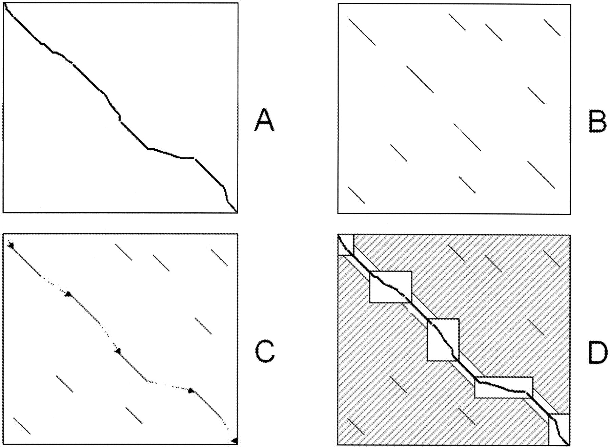

.. sidebar:: ToC

    .. contents::

.. _how-to-use-cases-lagan:

LAGAN
=====

Learning Objective
 You will learn how to write a simple LAGAN algorithm

Difficulty
  Advanced

Duration
  1h

Prerequisites
  :ref:`tutorial-datastrucures-indices-q-gram-index`, :ref:`tutorial-algorithms-seed-extension`

Background: Alignment of genomic sequences
------------------------------------------
By comparing two sequences of two different species, we can discover new information concerning
the conservation of functional units.
These discoveries can assist us in better understanding and analysing the cause of genetic diseases.
In order the compare two biological sequences we have to calculate a global alignment.
This will show us which operations are necessary to transform one into the other.
Unfortunately it is not advisable to perform a standard global alignment in order to align genomic sequences,
for its runtime is determined by the product of the length of both sequences.

Alternatively you can calculate local alignments in order to identify homologous regions.
Doing it this way does not allow us to defer connections between the shared order of the functional units.
In order to efficiently calculate a global alignment it is advisable to use heuristics that allow us to
identify useful local alignment,
which in turn will be utilized to calculate the global alignment.

One of the most famous examples of that kind of heuristic is the LAGAN-Algorithm.

   LAGAN example

It consists of three basics steps:
B) Generation of local alignments between the two genomes.
C) Construction of a global map by chaining the identified segments.
D) Calculation of the optimal alignment within the regions not covered by the local alignments.

The goal of this tutorial is to write a simple version of the LAGAN-Algorithm, which will be extended
to work iteratively in the last assignment.
Input will be two FASTA-files containing the genomes and the parameters for the seeding step.
The output will consist of a standard output containing the alignment.

Building q-gram-index
^^^^^^^^^^^^^^^^^^^^^

We will be reading two sequences from two different FASTA-files.
At first, our application should create a q-gram-index from the database.

Files can be read from disk with the function :dox:`SeqFileIn#readRecord` that expects
a file and two ``StringConcept`` objects.
The contents of different files can be loaded with subsequent calls of :dox:`SeqFileIn#readRecord`.
As we want the user to specify the files via command line, our application will parse
them using the :dox:`ArgumentParser` and store them in an option object.

.. includefrags:: demos/tutorial/lagan/assignment1.cpp
    :fragment: include

.. includefrags:: demos/tutorial/lagan/assignment1.cpp
    :fragment: sequences

We will call the reference seqH and the query seqV.
The seed parameters are stored in ``options.seedParams``.

In your first assignment we will begin writing a function that will allow us to to create a seed chain.
The function will look something like this:

.. includefrags:: demos/tutorial/lagan/assignment1.cpp
    :fragment: createSeedChainHead

Its parameters are the SeedChain object we are trying to create, followed by both sequences,
the current array containing the seed parameters and a tag containing specifying which type of seed we wish to use.
In our case it will be ``Seed<Simple>()``.

For now you will only need to complete a given code template and implement a way to create a q-gram-index
with variable size based on the reference.
We will use Open Addressing in order to be able to have the user enter a maximum q-gram-size of 31.

Assignment 1
""""""""""""

.. container:: assignment

   Type
     Application

   Objective
     Use the code template below (click **more...**) and implement a way to create a q-gram-index for
     SeqH while using open addressing.

     .. container:: foldable

        .. includefrags:: demos/tutorial/lagan/assignment1.cpp
            :fragment: createSeedChain

   Hint
     .. container:: foldable

       * use :dox:`OpenAddressingQGramIndex`.
       * use the function :dox:`Shape#resize`.

   Solution
     .. container:: foldable

        .. includefrags:: demos/tutorial/lagan/solution1.cpp
           :fragment: createSeedChain

Creating a Seed-Set and a Global-Chain
^^^^^^^^^^^^^^^^^^^^^^^^^^^^^^^^^^^^^^

Now that we have a q-gram-index we can begin to find our seeds based on the k-meres from our query.
For this we will use an infix with the specified q-gram-size based on SeqV.
We can find the position of an infix in the reference by hashing it.
This will allow us to add the found seeds to a seed-set using the chaos-chaining method.
Adding a seed via chaos-chaining requires a :dox:`Score`. For example:

.. includefrags:: demos/tutorial/lagan/solution2.cpp
    :fragment: scoringScheme

Examples on how to implement chaos-chaining can be found here: :dox:`SeedSet#addSeed`.

If a seed cannot be added using the chaos-chaining method,
you should add the seed using the simple-merge method in order to create a new anchor.

An empty ``seedSet`` can simply be created with:

.. includefrags:: demos/tutorial/lagan/solution2.cpp
    :fragment: seedSet

Using :dox:`chainSeedsGlobally` afterwards will chain the seeds into a global chain.

Assignment 2
""""""""""""

.. container:: assignment

   Type
     Application

   Objectives
     * Use the code template below (click **more...**) and complement the previous function so that it creates a seed-set for SeqV.
     * Additionally combine the seed set into a global chain.

     .. container:: foldable

        .. includefrags:: demos/tutorial/lagan/assignment2.cpp
           :fragment: createSeedChain

   Hint 1
     .. container:: foldable

       * use the function :dox:`SegmentableConcept#infix`.
       * use the function :dox:`Shape#hash`.
       * use the function :dox:`SeedSet#addSeed`.
       * use :dox:`Score`.
       * use the function :dox:`chainSeedsGlobally`.

   Solution
     .. container:: foldable

        .. includefrags:: demos/tutorial/lagan/solution2.cpp
           :fragment: createSeedChain

Creating the Alignment
^^^^^^^^^^^^^^^^^^^^^^

Now that we have successfully written a function that creates a global chain, it is time to defer the global alignment.

The seedChain will the be extended to a global alignment by using the banded-chain-alignment algorithm,
which will fill all the gaps left in the global chain by using the Needleman-Wunsch algorithm.

For this we need create an alignment object and specify the scoringSchemes as follows:

.. includefrags:: demos/tutorial/lagan/solution3.cpp
    :fragment: scoringSchemes

Assignment 3
""""""""""""

.. container:: assignment

   Type
     Application

   Objective
     Use the code template below (click **more...**) and implement a way to create an alignment based on the global chain.

     .. container:: foldable

        .. includefrags:: demos/tutorial/lagan/assignment3.cpp
            :fragment: main

   Hint
     .. container:: foldable

       * use the function :dox:`bandedChainAlignment`.
       * use :dox:`Score`.
       * use :dox:`Align`

   Solution
     .. container:: foldable

        .. includefrags:: demos/tutorial/lagan/solution3.cpp
            :fragment: alignment

Iterative LAGAN
^^^^^^^^^^^^^^^

.. warning::
    This is not trivial.

The following assignments will be more complex, because they will cover how to
include iterative steps in the LAGAN-algorithm.
This will allow us to increase the accuracy by trying to find new seed-chains within
areas previously not covered by the global chain.

For this we will first create a global seed set as we did before, but this time before we create a global chain we will
try to find new seeds in the areas in which we haven not already found a seed.
We will add those new smaller seeds to the global seed set again by using the chaos-chain method with the user specified parameters

A problem that will occur is that the position of the local seeds will not be aligned with the previous global seed,
this includes the upper and lower diagonal.
An in depth explanation can be found here: :ref:`tutorial-datastructures-seeds`.

In order to rectify this we will need a function that updates the position of the local seeds.
Because we will need the end Positions of the last global seed prior to the gap, the function will look something like this.

.. includefrags:: demos/tutorial/lagan/base.cpp
    :fragment: updateSeedPositionHead

Assignment 4
""""""""""""

.. container:: assignment

   Type
     Application

   Objective
     Use the code template below (click **more...**) and implement a way to update the seed position
     and the upper and lower diagonal
     in the global seed set.

     .. container:: foldable

        .. includefrags:: demos/tutorial/lagan/base_assignment.cpp
            :fragment: updateSeedPosition

   Hint 1
     .. container:: foldable

       * it is important to remember where the local seedChain has to be inserted into the global one.
       * do not forget to set the diagonals.
       * use the functions listed here :dox:`Seed#setBeginPositionH`.

   Hint 2
     .. container:: foldable

       * update the position of the seed by adding the global one.
       * you can get the global diagonal by subtracting the global positions of both sequences.

   Solution
     .. container:: foldable

        .. includefrags:: demos/tutorial/lagan/base.cpp
            :fragment: updateSeedPosition

Now that we have all the functions we need it is time for the last steps.

We can do this by creating a global seed set with the first set of parameters.

Now we need to iterate through all the parts of the sequence not covered by a seed and
create a local seed set in that area specified by the next set of parameters.

Assignment 5
""""""""""""

.. container:: assignment

   Type
     Application

   Objective
     Use the code template below (click **more...**) and implement a way to iterate through the
     parts not yet covered by the global seed set.
     We need to add these to the global seed set using the chaos-chaining method.
     At the end we can create a global seed chain and an alignment.

     .. container:: foldable

        .. includefrags:: demos/tutorial/lagan/base_assignment.cpp
            :fragment: main

   Hint
     .. container:: foldable

       * use the previous functions.
       * you need to update the positions of the local seeds with the positions of the last seed prior to the gap.

   Solution
     .. container:: foldable

        .. includefrags:: demos/tutorial/lagan/base.cpp
            :fragment: solution

Next Steps
----------

* Continue with the rest of the :ref:`tutorial`.